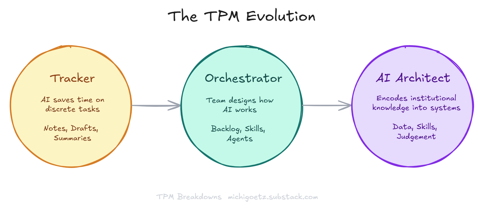
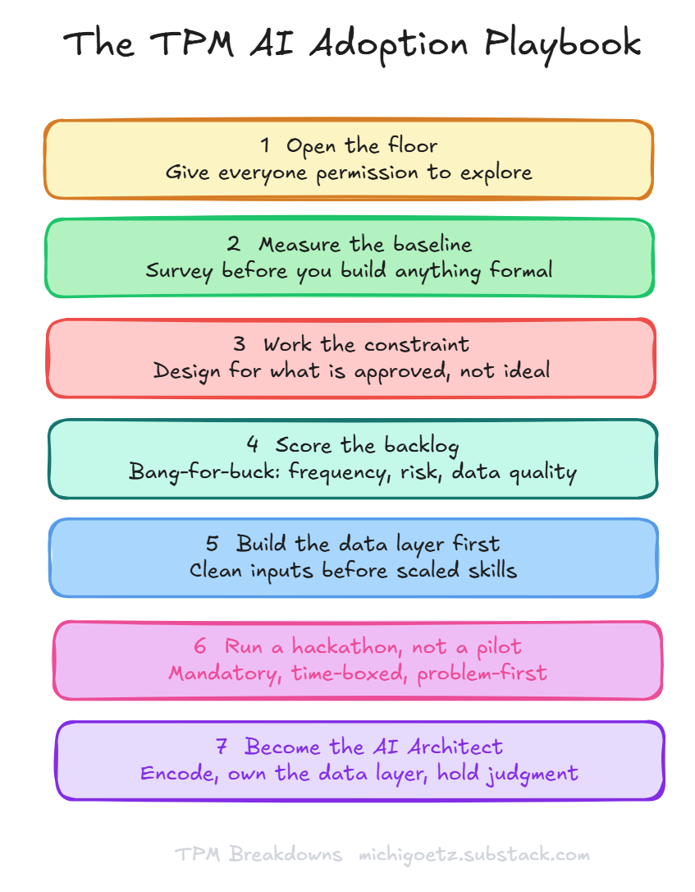

# Tracker. Orchestrator. AI Architect. Which One Are You?

**2026.AI.05** | A real team's AI adoption journey, a 7-step playbook for TPM leaders, and what the AI Architect stage actually looks like.

*Michi Goetz — March 31, 2026*

---

Gartner says 80% of program management will be automated by 2030.

Most responses to that number fall into one of two camps. The first is panic. The second is a 600-word essay explaining why AI is "just a tool" followed by a safe conclusion that nothing really changes.

The real question isn't whether AI replaces the TPM role. It's whether the work you're currently doing is actually program management, or whether it's the administrative layer that was always supposed to disappear. Status reports nobody acts on. RAG statuses that get updated Friday afternoon so the numbers look right for Monday. Risk registers that live in a doc nobody opens between meetings.

Let AI take that work. What's left is the job.

The harder question is: how do you actually get there? Not in theory. Inside a real team, with real tool restrictions, real skeptics, and a leadership expectation that you prove impact along the way.

This is the story of how one TPM team did it. And a playbook you can run yourself.

---

## Part 1: The Vision

### What AI takes. What it can't touch. Why TPMs are the ones who know the difference.

The industry signals in early 2026 are unambiguous. Wrike launched AI agents executing multi-step workflows autonomously, reporting a 4,900% surge in active users during preview. Asana built AI Teammates that manage complex workflows against corporate OKRs. Jira has Rovo, and many more are launching isolated solutions in your current tool stack. These aren't copilots suggesting your next move. They're handling the operational layer that used to justify headcount.

So let's be direct about what that layer looks like: bulk status updates and report formatting, consolidating program data across sources, drafting routine communications, maintaining document version control, scheduling reminders, follow-ups, and dashboards.

AI takes all of that. And it should. That work was never the job. It was the administrative crust that accumulated on top of the job.

What AI can't take: the process rules that exist only in practice, not in the documentation. The cross-functional context that lives in one person's head because no system captures it. The relational intelligence — who the silent blockers are, whose "yes" means nothing, which engineering lead needs to be in the room before a decision lands. The organizational history that explains why the current architecture looks the way it does. The judgment call when the data says green and the room feels amber.

That knowledge lives in silos. Mostly in the TPM's head. And it is the raw material of every agent you build.

This is the positioning that matters: no other role sits at the intersection of process knowledge, technical context, cross-functional visibility, and organizational judgment simultaneously. A PM owns the product decisions. An EM owns the engineering execution. The TPM owns the connective tissue between all of it, and sees where it breaks. That's not just a coordination skill. It's an architectural advantage.

Which means the TPM role doesn't disappear when agents handle the operational layer. It evolves through three stages:

1. **Tracker.** Most teams start here. AI saves time on discrete tasks. Meeting notes, status summaries, document drafts. Valuable, but additive. The work is still fundamentally the same.

2. **Orchestrator.** The team designs how AI works, not just uses it. Backlog of automation opportunities. Prioritization by impact. Skills built and shared across the team. The TPM is coordinating agents alongside people.

3. **AI Architect.** The endgame. The TPM encodes institutional knowledge into systems that outlast any individual. Defines what agents do and where they stop. Owns the data layer that feeds them. Holds the judgment layer that sits above them. Shapes the platform through real operational practice, not theory.

This is the north star: a TPM AI Operating System where agents handle the overhead and TPMs hold the judgment layer. Getting there requires running AI adoption like a program. Here's the playbook.

---

## Part 2: The Playbook

### Seven steps from one team's real journey

The 2026 State of AI for TPMs survey, co-authored with a group of TPM practitioners and leaders across the industry, captured what 252 program managers are actually doing with AI. Meeting summarization: 83% adoption. Status report generation: 64%. Cross-program dependency management: 38% using it, 57% wanting more. The pattern is consistent. Teams nail the easy use cases first, then stall before the harder ones.

What follows is the operational path from easy to hard, grounded in one team's journey over 1.5 years.

---

### Step 1: Open the floor

Before any structure, before any OKRs, give people permission to explore without gatekeeping. The principle that drove the early phase: share what you used and motivate others to optimize their day-to-day work. Don't reinvent the wheel. Start with what others already use. Bias to action over perfection.

This sounds obvious. It isn't. Most teams wait for a formal AI initiative before anyone feels safe experimenting. The teams that move fastest are the ones where the leader goes first, shares their own experiments publicly, and makes it clear that trying something imperfect is better than waiting for the approved tool list to catch up with the community.

The exploration phase has to come before the measurement phase. You can't survey what doesn't exist yet.

*IC TPM without a team to lead: start with yourself. Pick one task you do every week and try an AI tool on it. Share what happened in your next team meeting, one sentence. That's the floor being opened at a smaller scale.*

---

### Step 2: Measure the baseline

Once people are experimenting, run an internal survey before you build anything formal. The team ran a survey asking one core question: how is AI actually saving you time, and where is it still painful? The results: 3+ hours saved per week per person on average and high overall impact on productivity. Top use cases: meeting summarization, drafting, information retrieval.

The challenges mattered as much as the wins. Tool access was blocked for several high-value options. Quality gaps in some AI outputs were real. Data interpretation remained manual. That survey became a backlog. The gaps became the roadmap. The 177-minute number became the baseline against which everything else would be measured.

Without the baseline, you can't prove impact later. With it, you have a program.

*IC TPM: you don't need a formal survey. Track your own time for two weeks. Which tasks took longer than they should? Which outputs felt low-value the moment you finished them? That's your personal baseline.*

---

### Step 3: Work the constraint

Here is the gap nobody writes about honestly: the tools the TPM community is excited about are rarely the tools that clear enterprise procurement.

This team ran the first six months of meaningful AI adoption on Gemini and NotebookLM, not Claude Code, not Cursor. Not the tools dominating every practitioner newsletter. The approved stack, not the optimal stack.

That constraint shaped everything. Skills had to be designed for what was available. Workflows had to work within approved data handling. The temptation to wait for better tools had to be actively resisted. The result: the tools that saved hours per month across the team were the ones that got through legal, not the ones that won the benchmarks.

Document what's approved. Design for reality. The teams that stall on adoption are usually the ones waiting for permission to use the ideal tool instead of building with what exists.

*IC TPM: you almost certainly have access to at least one approved AI tool already. Start there. Waiting for the right tool is the most common reason nothing gets built.*

---

### Step 4: Score the backlog by bang-for-buck

Treat AI use cases like features. Create a backlog. Prioritize ruthlessly.

The scoring dimensions that worked: frequency (how often does this task happen?), complexity (how hard is it to automate?), data availability (is the input clean and accessible?), and risk (read-only or does it write back to systems?). Start read-only. Start high-frequency. Start with single data sources.

The first skills that shipped: meeting notes synthesis, blocker extraction, executive summary generation. All high-frequency. All zero write-risk. All pulling from a single source. That's not an accident. It's how you build trust in the system before you expand what the system does.

The bang-for-buck frame also surfaces the use cases worth skipping. If the data is dirty, the automation will be wrong at scale. If the task is low-frequency, the ROI doesn't justify the build time. Score before you build.

*IC TPM: pick one task from your own backlog. Score it on the four dimensions. If it's high-frequency, low-complexity, clean data, read-only, build it this week. That first shipped skill changes how you think about everything else.*

---

### Step 5: Build the data layer first

This is the step most AI adoption playbooks skip entirely.

Skills and agents are only as good as their inputs. Before the team could scale automation, it had to confront a harder problem: Jira tickets lacked context. Roadmaps were undocumented. Aha! entries were stale. When the data is wrong, AI tools don't just underperform. They confidently produce wrong outputs at scale.

Data hygiene is not an infrastructure problem. It's a program problem. Someone has to own it. The TPM is the right person, because the TPM is closest to where the data breaks down across system boundaries.

The three-layer architecture that emerged from this:
- **Data Layer:** clean structured information in source-of-truth tools
- **Skill Library:** single-purpose prompts and workflows that interact with that data
- **Agent Mesh:** autonomous or semi-autonomous agents that chain skills together to achieve broader goals

Each layer depends on the one below it. Agents hallucinate when the data layer is neglected. Fix the data first. Build the skills in parallel. Deploy agents when both are stable.

*IC TPM: pick one tool you rely on daily — Jira, Confluence, your meeting notes app. Spend 30 minutes auditing the quality of what's in it. Stale tickets, missing descriptions, undocumented decisions. Fixing that for your own programs is the data layer work, just scoped to you.*

---

### Step 6: Run a hackathon, not a pilot

A pilot gives people an exit. A hackathon creates shared fluency.

The team ran a full hackathon with structured pre-work starting four weeks out: challenge identification, team formation, infrastructure setup, refinement. The hackathon itself was half a day. Mandatory participation. Problem-first scoping ("how can we do task X better with AI?") rather than reproducing specific assets. Mentor checkpoints to remove blockers mid-build. Presentation and feedback at the end.

25+ participants. Three complex use cases that scaled globally. 90% of the team at "high adopter" status on the primary tool by the end of the quarter. 100% high adopters by January.

The weekly rhythm that followed mattered as much as the hackathon: an AI corner in the regular team meeting, weekly tips shared asynchronously, an Advent Calendar in December with 20+ AI use cases.

The key design principle: build together, share openly, never gatekeep what works. The team that builds in silos builds twice.

*IC TPM: you don't need a hackathon. Find one other TPM, or one engineer, who's curious about AI. Set a 90-minute working session. Pick one problem. Build something small together. Share it afterward. That's the nucleus.*

---

### Step 7: Become the AI Architect

Orchestration is the middle of the journey. The destination is something more specific.

The AI Architect is the TPM who doesn't just coordinate agents but designs the system: what each agent does, where it stops, what data feeds it, and which decisions stay human. The architect encodes the institutional knowledge that used to live in silos, in individual heads, in undocumented process rules, into reusable skills that outlast any single program or person.

You don't need to write every line of code. You need enough technical fluency to define the agent contracts, debug the data layer when outputs break, and know when the system is producing confident wrong answers rather than honest uncertainty.

The vision that drove the final phase named this directly: move away from "pockets of exploration" toward a true operating system. Deconstruct one program into a series of high-fidelity skills. Build an orchestration layer where agents handle the overhead. Free the TPM for strategy, judgment, and the human element that no dashboard captures.

By March 2026, the execution plan had 30 skills in the library, a week-by-week milestone plan through Q3, and a first integrated agent in scope for Q2. Skills covered the full program lifecycle: program initiation through architecture alignment, execution and delivery, launch, and closure.

That's not an AI experiment. That's a TPM operating model. And the TPM who built it is no longer a tracker. They're the architect of how the work gets done.

*IC TPM: you don't architect the whole system on day one. You start by owning one skill end to end: the input, the output schema, the iteration when it breaks. That's the architect move at IC scale. One well-built skill teaches you more than ten experiments.*

---

## Part 3: One real example

### The Stakeholder Map Skill

**The problem**

Stakeholder mapping was inconsistent across programs. Quality depended entirely on who was running the program and how long they'd been in the organization. The knowledge that should have lived in a document lived in someone's head instead.

Each role felt this differently:

- **Product Manager:** Entered alignment conversations without knowing who the silent blockers were. Discovered coverage gaps after the meeting, not before. Spent political capital on decisions that needed re-litigating because the wrong people were absent.
- **Product Designer:** Got pulled into reviews late because nobody mapped design as a required stakeholder early. Feedback arrived after decisions were already made. Rework followed.
- **Engineering Lead:** Unclear who owned sign-off on architecture decisions. Escalations went to the wrong person. Dependencies on external teams surfaced under time pressure rather than at planning.
- **TPM:** Rebuilt the stakeholder map from scratch on every program. Quality correlated directly with tenure. New TPMs joining mid-program had no structured way to inherit the relational context.

**Why it was breaking**

The task is high-judgment but highly repeatable in structure. Every program needs the same categories: stakeholders, influence level, gaps, inclusion rationale, follow-up owners. The variance wasn't in what was needed. It was in whether it happened and how completely. Tribal knowledge doesn't scale. It walks out the door.

**What was built**

The `/tpm-stakeholder-map` skill takes a PRD, program brief, meeting notes, or any program document as input. It:

- Extracts all named stakeholders and infers likely missing ones
- Maps each by influence level and current engagement status
- Identifies gaps and inclusion rationale
- Flags follow-up actions with suggested owners
- Outputs a structured, repeatable map usable as a working program artifact

**What changed per role**

- **Product Manager:** Stakeholder coverage reviewable before alignment conversations. Gaps visible before they become political problems.
- **Product Designer:** Design stakeholders mapped at program initiation, not discovered when feedback arrives late.
- **Engineering Lead:** Architecture sign-off owners documented. External dependencies flagged at planning rather than execution.
- **TPM:** Structured baseline on day one of any program. Relational context inheritable from the document rather than from the person who built the last one.

**What the iteration revealed**

The output had to be deterministic, not generative. A stakeholder map that varies in structure every time is not a program artifact. It's a draft. Repeatability required defining the output schema precisely, not just the prompt. That principle extended to every skill that followed: encode the judgment, not just the task.

---

## Closing

Gartner's 80% automation figure is probably right. The 80% it's describing is the work that was never really program management. It was the administrative layer that program management got buried under.

What the survey of 252 TPMs shows is that practitioners already know this. They're using AI for the routine tasks. They want more AI for the harder ones: dependency management, risk identification, cross-program synthesis. The tools exist. The constraint is rarely the technology.

The TPMs who will lead in the next three years aren't the ones who panic about automation or dismiss it. They're the ones who encode what they know into systems, own the data layer that feeds them, and hold the judgment that no agent can replace.

Tracker. Orchestrator. AI Architect.

That's the arc. The question is where you are on it, and whether you're moving.

---

*Next: TPM Delivery Agent and the Stakeholder Map Skill with a walkthrough.*

*You can find the TPM Skill library on [GitHub](https://github.com/michigoetz-tpm). Let me know if you want to contribute!*

*Let's build*  
*Michi*

---

*TPM Breakdowns is a reader-supported publication. [Subscribe at michigoetz.substack.com](https://michigoetz.substack.com)*
