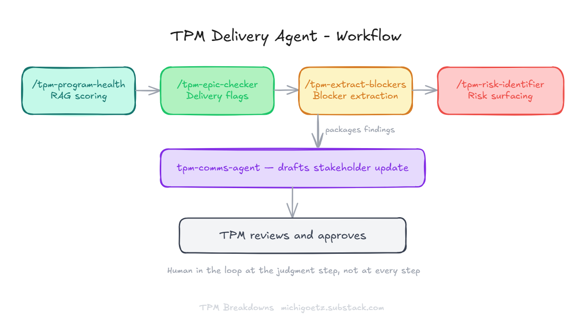
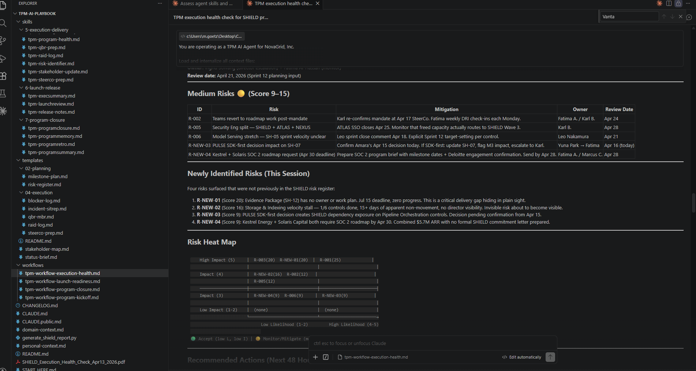
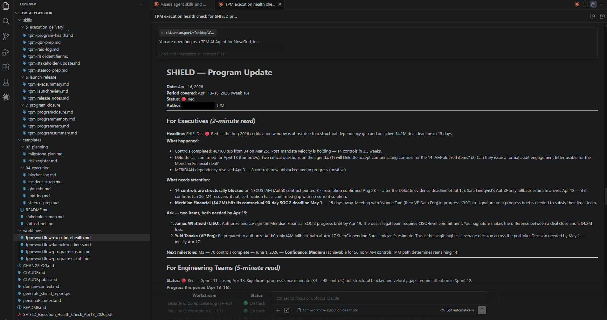
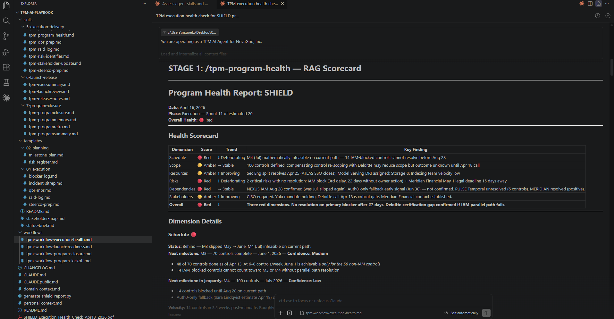

# The TPM had a risk register. The workflow found four more.

**2026.AI.06** | Four skills. One comms agent. One workflow that caught what the TPM missed.

*Michi Goetz | April 16th, 2026*

Published on [TPM Breakdowns](https://michigoetz.substack.com/p/the-tpm-had-a-risk-register)

---

You're running a P0 program. SOC 2 Type II certification. Audit date fixed with an external firm. $180K contract signed. Three enterprise deals, $10.1M in pipeline, contractually blocked until the cert lands. Board mandate. August deadline. No buffer.

Every Friday, you need to know the real status of the program. Not the optimistic version. Not the version that looked right before someone updated Jira on Thursday afternoon. The version you'd stake your credibility on in front of the VP of Engineering.

That read used to take 45 minutes. Pull the epic statuses. Cross-reference the risk log. Check what's stale. Reconcile Jira with Aha!. Assemble the stakeholder update by audience. By the time you finished, you'd spent more time on the assembly than on the judgment.

The Delivery Agent changes what those 45 minutes are for.

And in one case on the SHIELD program, it caught four risks the TPM hadn't logged.

---

## The workflow

The program in this walkthrough is SHIELD, a SOC 2 Type II certification program running inside NovaGrid, Inc. Both are fictional. NovaGrid is a sandbox built for the TPM AI Playbook: a post-IPO B2B platform with real program complexity, synthetic data across Jira, Aha!, and Salesforce, and a full library of skills and agents you can run against it. Think of it as a flight simulator for TPM AI workflows. The GitHub library is public (link at the end).

The output below came from a real Claude Code session against that sandbox.

The Delivery Agent is not a single thing. It's four skills chained in sequence, each carrying its findings into the next:

```
/tpm-program-health     → RAG scoring across 6 dimensions
/tpm-epic-checker       → delivery flags at the epic level  
/tpm-extract-blockers   → blocker extraction and classification
/tpm-risk-identifier    → risk surfacing and register update
        ↓
tpm-comms-agent         → drafts the stakeholder update
        ↓
TPM reviews and approves
```

In the Tracker → Orchestrator → AI Architect arc from Article 5, this is Orchestrator work. You're not just using AI on discrete tasks. You're designing how AI moves through a program, what it hands off at each stage, and where you step in. The Delivery Agent is what that looks like in practice.

One clarification worth making: this is technically a workflow, four skills in sequence, with one agentic step at the end that drafts the stakeholder update. The distinction matters less than the design principle underneath it.

The key design principle: human in the loop at the judgment step, not at every step. You don't review after each stage. You review the final output as a judgment call, not a formatting check.


*The four-stage chain: RAG scoring → delivery flags → blocker extraction → risk surfacing → stakeholder update → TPM approves*

---

## The run

NovaGrid's SHIELD program. SOC 2 Type II. External audit date fixed. August deadline. The session loaded company context, org chart, and the SHIELD program master doc, then ran all four stages.

The first two stages did what you'd expect. Health scorecard: Overall Red, driven by Dependencies (14 controls blocked on NEXUS IAM, confirmed August 28) and Risks (two critical, unmitigated). Epic check: one critical flag on Wave 3 Model Serving, plateauing at 24% with the IAM blocker as the ceiling. Two at-risk. One on track.

Stage 3 is where it gets interesting.

The TPM had risks on the radar. The agent produced four that hadn't been logged:

**R-NEW-01 (Score 20): Evidence Package has no owner or work plan.** July 15 deadline. Zero progress. A critical delivery gap sitting in plain sight.

**R-NEW-02 (Score 16): Storage & Indexing velocity stalled.** 1 of 6 controls done. 15+ days of apparent non-movement. No director visibility. An invisible risk about to become visible.

**R-NEW-03 (Score 9): PULSE SDK-first decision creates a SHIELD dependency.** Pipeline Orchestration controls now depend on a decision pending confirmation from April 15. Cross-program risk, not yet tracked.

**R-NEW-04 (Score 9): Two enterprise deals require a SOC 2 roadmap by April 30.** Combined $5.7M ARR. No formal commitment letter prepared.


*Claude Code session: "Newly Identified Risks (This Session)" with library structure visible in sidebar*

The agent didn't save time on those four. It caught something the TPM had missed. That's a different claim than "AI saves hours on admin."

Why did it catch them when the TPM didn't? The agent doesn't get tired or distracted at the end of the workweek. It reads every field with the same attention: the evidence package ownership gap, the velocity data on Storage & Indexing, the cross-program dependency signal from PULSE, the enterprise deal deadlines sitting in Salesforce, regardless of whether it's 9am Monday or 4pm Friday before a SteerCo. The TPM, under time pressure, reads for the things that already feel urgent. The agent reads everything.

Stage 4 produced a three-tier stakeholder update. The exec section had a real ask: a named decision, a named owner, a deadline. Not "keeping you informed."


*Stage 4 output: SHIELD exec update with named asks, owners, and deadlines*

---

## What almost went wrong

Look at Stage 1. Scope scores Amber Improving. That's correct: 100 controls stable, all ownership gaps closed, the March 25 mandate resolved the orphaned controls problem. The agent read the data accurately.


*Stage 1 output: Program Health Report for SHIELD showing Scope at Amber Improving*

Here's the near-miss. The auditor compensating controls question, whether the audit accepts 86 controls plus a compensating approach for the 14 IAM-blocked items, was logged in the SHIELD master doc. It showed up in the Scope dimension as an open question, which is why Scope landed Amber and not Green.

If that question hadn't been documented, Scope scores Green. Stable at 100 controls. All assigned. No scope creep. Technically accurate. Completely misleading.

The agent didn't produce a false green because the data was right. Not because the thresholds were calibrated correctly. Not because the prompts were well-engineered.

**The agent is only as honest as what you feed it.**

This is the data layer argument from Article 5 in practice. Skills and agents sit on top of whatever is in your source-of-truth tools. When the data is wrong, stale Jira tickets, undocumented decisions, missing risk log entries, AI tools don't underperform quietly. They produce confident wrong outputs at scale. A health check that scores Scope Green on a program where the audit approach is unresolved isn't a minor error. It's the kind of thing that gets sent to an executive and damages trust in the system.

The fix isn't better prompts. It's better data. Someone has to own that. The TPM is the right person, because the TPM is closest to where the data breaks down across system boundaries.

---

## The human-in-the-loop design choice

The workflow ends with "TPM reviews and approves." That's not a formality, and it's not the only thing the TPM owns.

The TPM owns the data layer that feeds the agent. Clean program master doc. Documented decisions. Risk log entries that reflect reality, not the optimistic version. Without that, the approval step is theater. You're reviewing output that was never going to be honest.

Assuming the data layer is right: the agent produced a scorecard, an epic flag list, a risk register, and a drafted stakeholder update. The review isn't a formatting check. You're asking whether the risk scores match your read of the room, whether the likelihood ratings hold given what you know that no document captures.

What the agent can't produce: the read on why a dependency has slipped three times, not once. That pattern changes the probability weight on the risk. The agent scores likelihood correctly given the data. It doesn't know what the pattern says about the team's ability to force the decision.

It also can't tell you whose yes actually moves things. A name appears in the exec ask. Whether that person will authorize before the deadline depends on what happened in the last three SteerCos, what leadership said about the enterprise pipeline last week, and whether this is the kind of decision they make alone or route back through the board. That context lives in your head. It doesn't live in any document the agent can read.

The agent handles the overhead. The TPM owns the data layer and holds the judgment above it.

That's the design. Not "AI does the work, TPM approves." Human in the loop at the judgment step, which means the judgment step is where your time actually goes.

---

## The IC entry point

The workflow supports mid-entry. You don't have to run all four stages.

If you have a program with a clean risk register and no epic staleness concerns, start at Stage 4. Feed the health scorecard directly into the stakeholder update skill. If you're doing a pre-SteerCo check and only need the epic flags, run Stage 2 alone.

The IC move: pick the one stage that would have saved you the most time last week. Run it once. See what it catches. That first run teaches you more about where your data layer is broken than any amount of planning does.

The full library, 30+ skills across the program lifecycle, the NovaGrid sandbox, and the Delivery Agent workflow, is on GitHub.

---

## What's next

The Delivery Agent reads the program. It scores the dimensions, flags the epics, surfaces the risks, drafts the update.

What it doesn't do: ask the questions that change the read.

Next: the TPM Power Questions, 30 questions the agent can't ask, and the skill that puts them at the judgment step where they belong.

---

*The TPM AI Playbook, NovaGrid sandbox, the Delivery Agent workflow, and 30+ skills, is open on GitHub. If you want to run this against your own program context, the library is public.*

*Let's build.*

*Michi*
