# What AI reads. What you have to ask.

**2026.AI.07** | 30 questions cross-functional programs break on. One workflow. Any AI tool. Built for TPMs, EMs, Software Engineers, and PMs.

*Michi Goetz | April 2026*

---

AI can read your program data. It cannot ask the question that matters.

An agent reads three programs in red, two P0s amber, two resource conflicts cutting across the whole portfolio and produces a clean summary. Accurate. Complete. It tells you what is there. It does not tell you what to ask next.

"Whose yes in this group means nothing without someone else's yes?"

"Which pending decision has the longest blast radius across teams?"

"What is the one thing that would break this timeline that we are not talking about?"

No prompt generates these questions without the organizational context that lives in the practitioner's head. That is not an AI capability problem. It is an organizational knowledge problem. And organizational knowledge is the layer AI sits below.

One more thing: the questions are only as powerful as the environment that allows honest answers. "Where is this program most likely to break and who in the room knows but has not said it?" only works if the room is safe enough for someone to say it. That is a leadership problem, not a question problem.

Article 6 showed how the Delivery Agent reads your program data and drafts the stakeholder update. This article names the questions that sit above it. The practitioners who operate at this layer do not just use agents. They design how agents work, define what agents decide, and hold the judgment that no agent can substitute for. This article makes that judgment layer concrete. Thirty questions. Two modes. One workflow you can run today in any AI tool you already use.

---

## The workflow

`/tpm-power-questions` is a prompt-based workflow that maps your program situation to the highest-leverage questions for cross-functional delivery. It runs in Claude, ChatGPT, Gemini, or any AI assistant you already use. Copy the prompt from github.com/michigoetz-tpm/tpm-use-cases and paste it into your AI tool of choice.

Most programs do not break because of missing data. They break because nobody asked the right question at the right moment. Describe what is happening (a sentence, a Slack message, or paste in your program status) and it returns the questions that surface what the data cannot say.

It runs in two modes.

**Mode 1: Situational lookup.** The skill reads the context, classifies the situation, and returns 3-5 questions for that moment. Questions only if you are about to walk into a room. Questions plus one line on what each surfaces if you are diagnosing something that feels wrong.

**Mode 2: AI governance pre-flight.** Five questions in sequence before expanding what an agent does or before trusting an automated output that informs a decision. Not a lookup. A structured review before a decision.

The skill routes between the two modes based on your situation. If an agent is producing outputs that feed your program decisions, it runs Mode 1 first, then Mode 2.

The more specific your situation, the sharper the questions. "Help me with my program meeting" returns generic questions. "We have a steering committee in 60 minutes and three teams have different answers on what we are delivering by end of quarter" returns the four questions you need before you walk in.

---

## What AI can and cannot do with questions

AI can generate a list of questions for a meeting type. It can surface a template question based on keywords. It can flag a missing dependency link and suggest asking about it.

What it cannot do:

Know that this engineering lead shuts down when asked "what's blocking you" in front of their PM but opens up in a 1:1. Read that the room went quiet after the timeline slide and that silence means someone already knows the answer. Recognize that "we're aligned" from this particular stakeholder means the opposite. Know whose absence from a decision will create a problem three weeks from now.

The question is not the judgment. Knowing when not to ask it, how to ask it, and to whom is the judgment. The layer AI sits below.

An agent generating questions is pattern matching against your situation description. A practitioner asking the right question is applying relational knowledge: who in this room knows something they have not said, whose endorsement is real and whose is performative, which team will surface a problem through their absence rather than their words. That knowledge does not live in Jira. It lives in the person who has been in the organization long enough to read the room.

One caveat: the questions in this library require human judgment today. The boundary moves as agent capabilities improve. The skill here is staying ahead of where that boundary currently sits, not holding a fixed line.

---

## The NovaGrid run

NovaGrid is a fictional company I built as the sandbox for the TPM AI Use Cases library. Six active programs, a portfolio simulator agent, live Jira data, and a SteerCo on April 24.

Three people to track. Yuki Tanaka is the VP of Engineering with authorization authority on the Auth0-only IAM decision, the highest-stakes call in the portfolio. Karl Bergstrom is the exec sponsor running the April 24 SteerCo. Priya is the PM confirming Kestrel's scope by April 25, a confirmation that determines whether an $800K Salesforce revenue figure is accurate or overstated.

The `/tpm-power-questions` workflow was run against the NovaGrid program context in Claude Code. Portfolio state at the moment of the run: PULSE M4 confirmed August 12. Auth0-only IAM feasibility confirmed, Yuki decision May 1. Kestrel restructured. Model Serving at 145% overcommit with a working session needed that week. SteerCo April 24. Sprint 12 active. The portfolio-simulator agent had run on April 20 and its outputs were feeding the SteerCo pre-read and the Auth0 authorization brief.

---

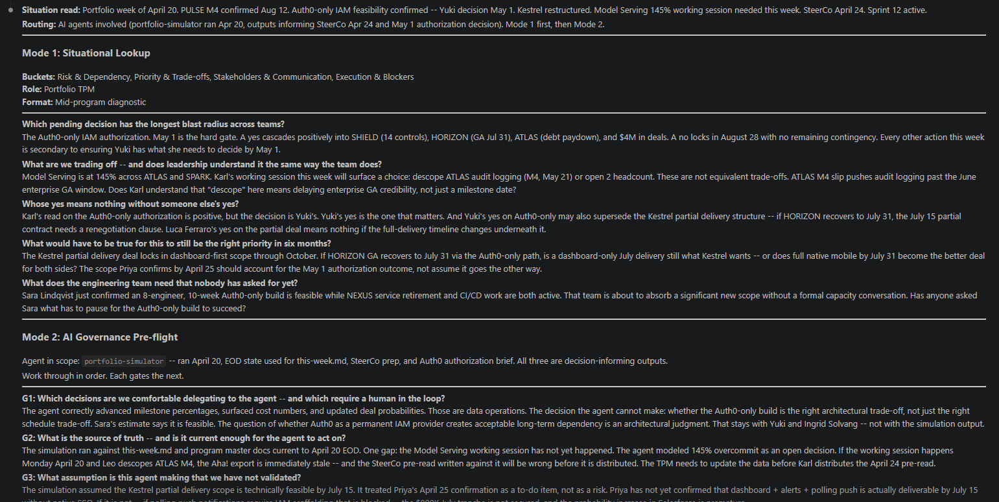

*The skill reads the live portfolio state, classifies the situation, and routes before returning a single question.*

---

Before returning a single question, the skill classified the situation:

Buckets: Risk and Dependency, Priority and Trade-offs, Stakeholders and Communication, Execution and Blockers. Role: Portfolio TPM. Format: Mid-program diagnostic.

That routing step is the argument. The skill read the context and identified which of the eight situation buckets applied before surfacing anything. Here is what Mode 1 returned, verbatim:

**Which pending decision has the longest blast radius across teams?**
The Auth0-only IAM authorization. May 1 is the hard gate. A yes cascades into SHIELD (14 controls), HORIZON (GA July 31), ATLAS (debt paydown), and $4M in deals. A no locks in August 28 with no remaining contingency. Every other action this week is secondary to ensuring Yuki has what she needs to decide by May 1.

**What are we trading off and does leadership understand it the same way the team does?**
Model Serving is at 145% across ATLAS and SPARK. Karl's working session this week will surface a choice: descope ATLAS audit logging or open 2 headcount. These are not equivalent trade-offs. ATLAS M4 slip pushes audit logging past the June enterprise GA window. Does Karl understand that "descope" here means delaying enterprise GA credibility, not just a milestone date?

**Whose yes means nothing without someone else's yes?**
Karl's read on the Auth0-only authorization is positive, but the decision is Yuki's. And Yuki's yes on Auth0-only may also supersede the Kestrel partial delivery structure. If HORIZON recovers to July 31, the July 15 partial contract needs a renegotiation clause. Luca Ferraro's yes on the partial deal means nothing if the full-delivery timeline changes underneath it.

**What does the engineering team need that nobody has asked for yet?**
Sara Lindqvist confirmed an 8-engineer, 10-week Auth0-only build is feasible while NEXUS service retirement and CI/CD work are both active. That team is about to absorb significant new scope without a formal capacity conversation. Has anyone asked Sara what has to pause for the Auth0-only build to succeed?

---

Then Mode 2: the governance pre-flight on the portfolio-simulator agent itself.

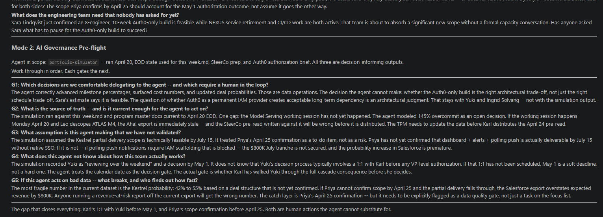

*G4 catches what org charts cannot show. G5 names the exact number that breaks if the catch layer fails.*

---

Three gaps the portfolio data did not contain:

**G2** found a data staleness window. If the Model Serving working session happens Monday and Leo descopes ATLAS M4, the Aha! export is immediately stale and the SteerCo pre-read will be wrong before Karl distributes it on April 24. Named fix, named owner, 48-hour window.

**G4** caught something no data source holds. Yuki's decision process typically involves a 1:1 with Karl before any VP-level authorization. May 1 is a soft deadline, not a hard one. The agent treats the calendar date as the decision gate. It is not.

**G5** named the exact fragile number. The Kestrel probability increase from 42% to 55% is based on a deal structure not yet confirmed. Anyone running a revenue-at-risk report off the current Salesforce export gets the wrong number by $800K. The catch layer is Priya's April 25 confirmation, flagged as a data quality gate, not a calendar task.

The skill closed with this:

*"The gap that closes everything: Karl's 1:1 with Yuki before May 1, and Priya's scope confirmation before April 25. Both are human actions the agent cannot substitute for."*

The agent read the portfolio. It named two human actions that determine whether everything else is accurate. It could not take those actions. It could only surface where the judgment layer has to act.

The NovaGrid context is public. You can run this yourself at github.com/michigoetz-tpm/tpm-use-cases.

---

## The 30 questions

### Mode 1: Situational questions

Eight situation buckets. Find the one that matches what is happening in your program right now. Each bucket has its own question table below. If your situation spans multiple buckets, pull from all that apply.

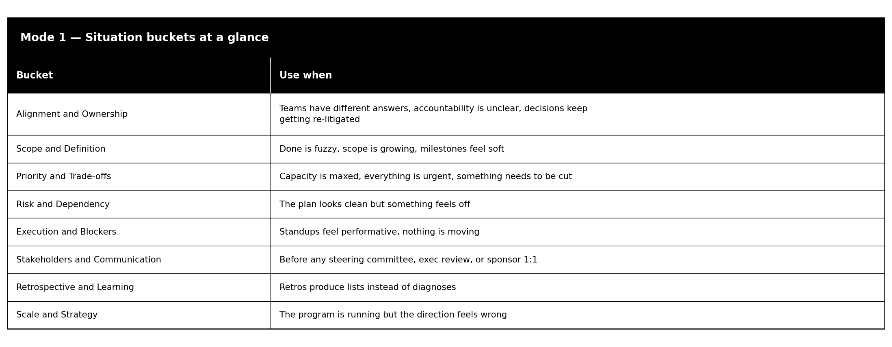

**Alignment and Ownership**. Use when teams have different answers, accountability is unclear, or decisions keep getting re-litigated.

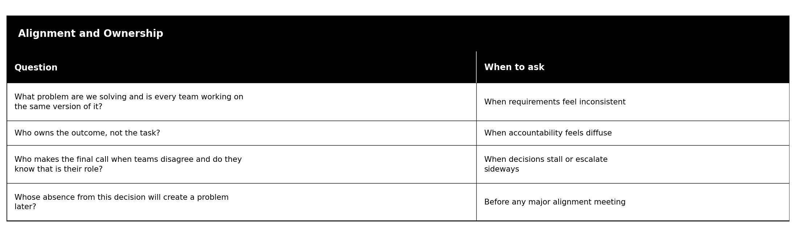

**Scope and Definition**. Use when done is fuzzy, scope is growing, or milestones feel soft.

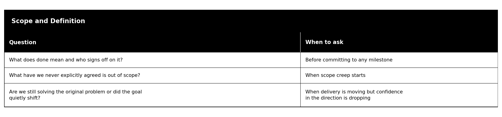

**Priority and Trade-offs**. Use when capacity is maxed, everything is urgent, or something needs to be cut.

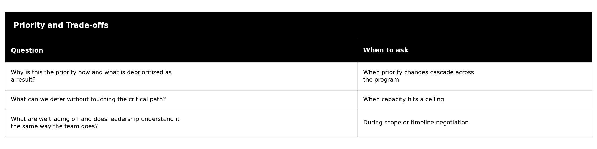

**Risk and Dependency**. Use when the plan looks clean but something feels off.

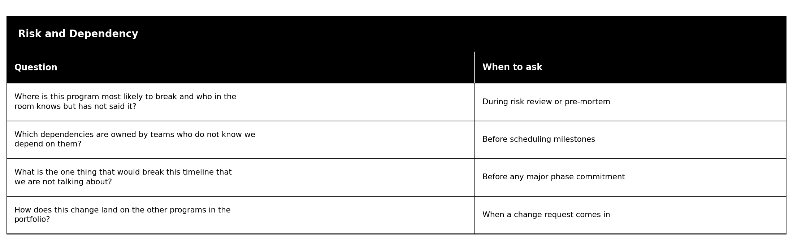

**Execution and Blockers**. Use when standups feel performative or nothing is moving.

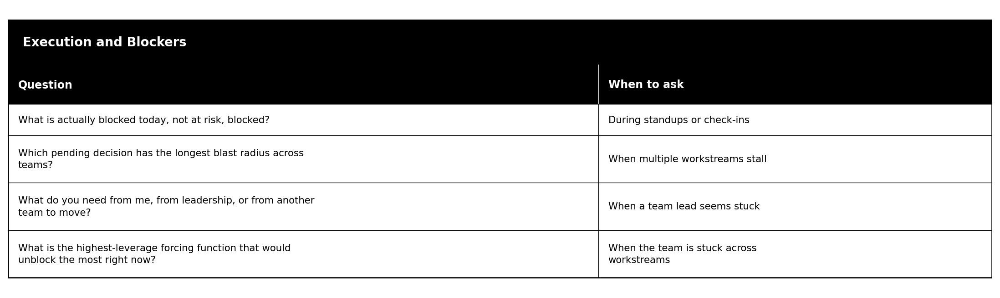

**Stakeholders and Communication**. Use before any steering committee, exec review, or sponsor 1:1.

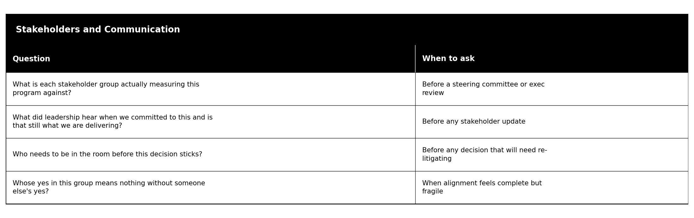

**Retrospective and Learning**. Use when retros produce lists instead of diagnoses.

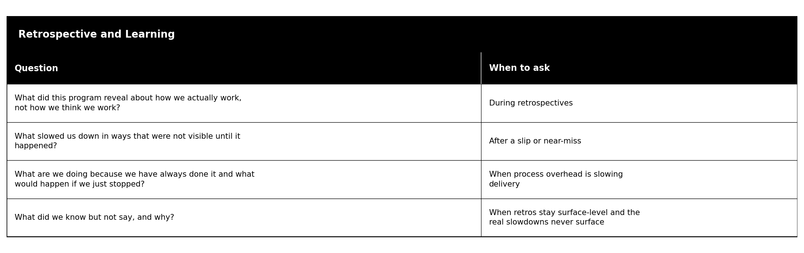

**Scale and Strategy**. Use when the program is running but the direction feels wrong.

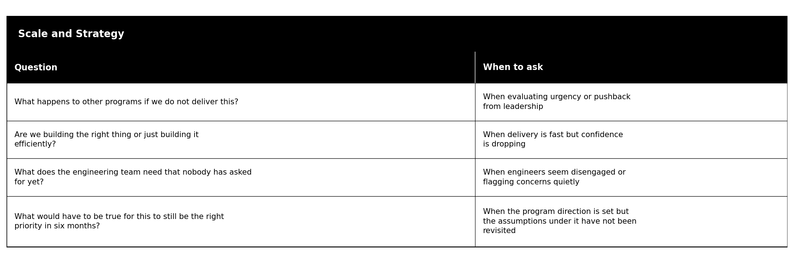

Pick the bucket that matches your next meeting. You do not need all 25.

---

### Mode 2: AI Governance Pre-flight

Mode 1 is for your program. Mode 2 is for your agent, any agent producing outputs that inform decisions. Run this before expanding what an agent does or before trusting an automated output. Work through all five in order. Each one gates the next. Scale the depth to the risk: a summarization agent needs a lighter review than a comms agent sending stakeholder updates with revenue figures in them.

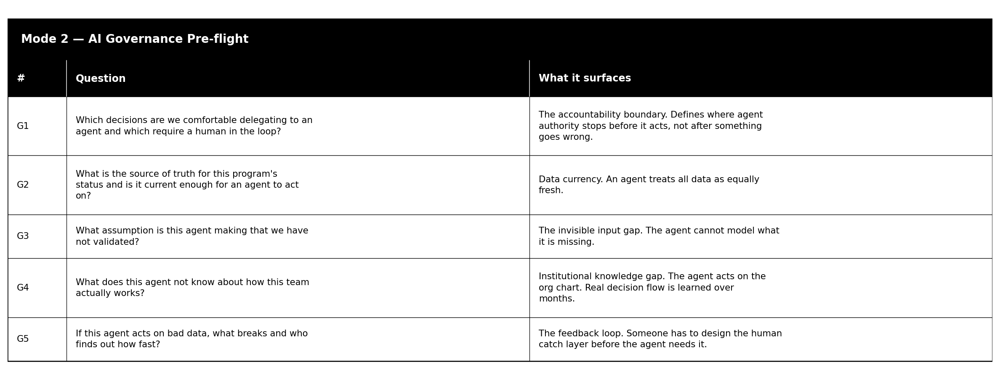

Document the answers. The pre-flight is only useful if it is written down and revisited when the agent changes.

*Run Mode 2 before you remove a human review step from any automated workflow. All five. In order.*

---

## Not just for TPMs

The judgment layer argument applies equally to Engineering Managers, Software Engineers, and Product Managers. The questions change shape by role. The underlying problem is the same: AI reads what is in the system. The practitioner asks what it means.

**Engineering Managers**

The system shows ticket status and velocity. It does not show that one engineer is carrying three critical path items silently, or that an architecture decision from Q1 is creating debt that will surface as a slip in Q3.

Three questions that shift for EMs: "What does the engineering team need that nobody has asked for yet?" becomes a daily question, not a periodic one. "Which dependencies are owned by teams who do not know we depend on them?" maps to cross-team API contracts and shared infrastructure assumptions that break in integration. "What assumption is this agent making that we have not validated?" applies to every AI-assisted sprint planning estimate or velocity forecast the team uses.

An EM who runs Mode 2 before trusting an AI-generated capacity forecast is doing exactly what the TPM does before trusting a portfolio status report: asking what the model does not know about how the team actually works.

**Software Engineers**

Engineers interact with AI outputs constantly: code suggestions, test coverage analysis, PR reviews, architectural recommendations.

G3 is the question before trusting a code suggestion that compiles but may introduce a security pattern deprecated in your stack. G4 is the question before accepting an architectural suggestion generated without context on your team's operational constraints. From Mode 1: "Are we still solving the original problem or did the goal quietly shift?" belongs in sprint planning when requirements arrive pre-specified. "What have we never explicitly agreed is out of scope?" prevents the scope creep that accumulates between engineers and PMs when nobody has written down the boundary.

**Product Managers**

PMs ask versions of these questions constantly. The cross-functional reframe is what changes.

"What is each stakeholder group actually measuring this program against?" in a cross-functional context has three different answers: engineering (delivery confidence), design (quality and coverage), business (revenue and timeline). The question holds all three simultaneously and asks whether leadership understands the gap between them. "What did this program reveal about how we actually work?" is the retro question PMs do not get to ask because the retro is scoped to the sprint, not the program. G3 applies before presenting an AI-generated competitive analysis to a leadership team. The agent synthesized what it had. What it did not have may be the most important input.

---

## What's next

The agent reads. You ask. The next question in this series: what happens when the questions surface something the org is not ready to hear? That is the escalation problem.

---

*The TPM AI Playbook, NovaGrid sandbox, and the full question library are open on GitHub. If you want to run this against your own program context, the library is public.*

*Let's build.*

*Michi*
