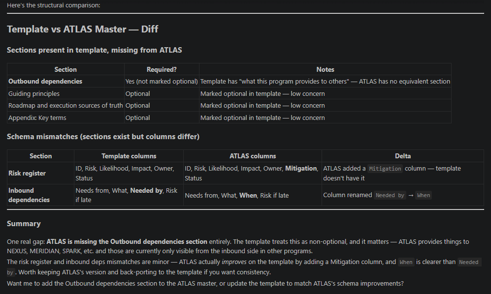
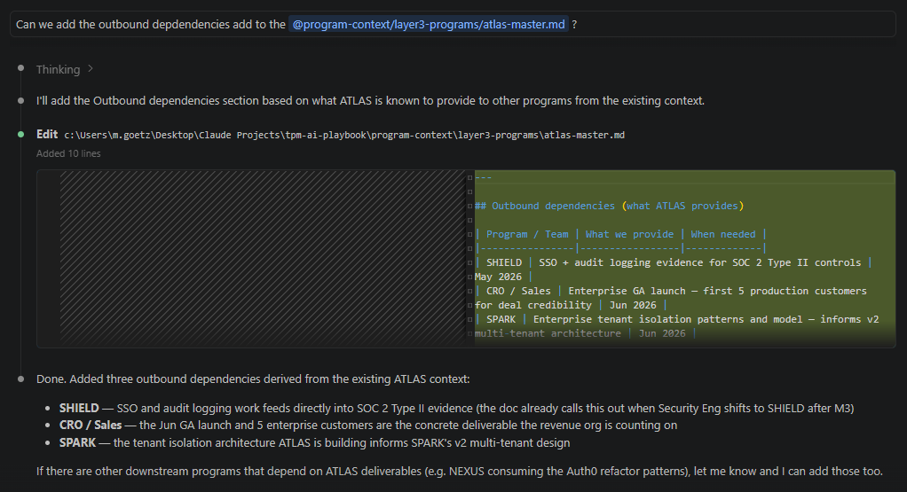

# The agent didn't fail. Your data layer did.

**2026.AI.08** | Why every artifact in your program library belongs in a repo, how diffs compound knowledge, and what the flywheel looks like when it actually runs.

*Michi Goetz — May 2026*

---

Program starts. Someone builds a risk register in a spreadsheet because that is what the team knows. Someone else tracks blockers in Jira because that is where the engineers live. The SteerCo deck gets a status slide each week because that is what leadership sees. By week six, those artifacts disagree on which risks are open, which blockers are escalated, and what the current milestone dates are.

Nobody planned for this. It accumulated.

When you introduce an agent into that environment, it does exactly what you told it: reads the file you pointed at. If that file is three weeks stale, the agent is three weeks stale. If a critical dependency materialized after the last update, the agent has no signal. The output looks confident. The read is wrong.

The fix is not better prompting. It is one source, in one format, in one location -- machine-readable by default, not after you export it. And when that source lives in a repo, every update is a diff, every diff is a record, and over time those records encode what your org has actually learned. A spreadsheet gets overwritten. A repo accumulates.

---

## What this costs you

An agent read a program's risk register and surfaced three risks. The program had seven open. It missed four.

Not because the model was wrong. Because the canonical risk register didn't exist. What existed was a spreadsheet someone maintained through March, a Jira filter with a different set of rows, and a slide in the last SteerCo deck that nobody had updated since a new dependency materialized. Three sources. Three versions of truth. The agent read one of them.

That is not an AI problem. That is a data layer problem with an AI-shaped consequence. And it does not only happen to the risk register -- it happens to every artifact in your program.

---

## Every artifact in your program has this problem

You already have all of these. The question is where they live and whether an agent can read them reliably.

**Initiation and planning:**
- **Program master** -- objective, scope, milestones, risks, dependencies, stakeholders, latest update. If it lives in a doc nobody maintains, the agent reads a snapshot from three weeks ago.
- **Milestone plan** -- milestones, exit criteria, critical path, float. If this lives only in a Gantt chart or a slide, the agent cannot read whether float has eroded.
- **Risk register** -- risks, likelihood, impact, mitigations, owners, status. Three sources means the agent picks one.
- **Stakeholder map** -- groups, channels, cadences, RACI. If this only exists in a kickoff slide, the agent cannot tell you whether the right people are in the loop.

**Execution:**
- **RAID log** -- risks, assumptions, issues, dependencies consolidated. The blocker that sat unresolved for two weeks because nobody could see it across workstreams.
- **Blocker log** -- active impediments, owners, resolution paths, escalation triggers. If blockers only live in Jira, the agent sees tasks, not the escalation pattern above them.
- **SteerCo prep** -- decision items, options, recommendations, consequence if not decided. If this only exists as a slide the morning of the meeting, the decision record disappears after the call.
- **Status brief** -- exec brief, team brief, stakeholder brief. If the only artifact is the slide, the written record for agents does not exist.

**Reviews:**
- **QBR / MBR** -- plan vs. actuals, what changed, ask for next period. If this lives in a presentation nobody exports, the quarterly learning record is locked in a file agents cannot parse.
- **Incident SitRep** -- current status, impact, timeline, what we know, what we are doing. If incident comms only happen in Slack, the structured record for post-mortem and future agent reads does not exist.

```
domain-context.md               org-wide defaults, team structure, norms
  program-master.md             weekly truth for one program
  raid-log.md                   risks, assumptions, issues, dependencies
  risk-register.md              deep risk rows with mitigations
  milestone-plan.md             milestones, exit criteria, critical path
  blocker-log.md                active impediments and escalation triggers
  steerco-prep.md               decision items, options, recommendations
  status-brief.md               exec, team, and stakeholder formats
  qbr-mbr.md                    plan vs. actuals, quarterly learning record
  incident-sitrep.md            structured incident record

skills / agents                 read the above as context
power questions                 run against what the skills surface
```

Every file in that stack is a potential failure point if it lives somewhere else.

---

## Why format is not a filing preference

Most TPMs treat artifact format as a convenience choice. PDF for sharing. Google Doc for collaboration. PowerPoint for leadership. Jira for execution. That logic works for humans. It breaks for agents.

Every format is a different extraction problem. A PDF needs a parser that may miss tables or misread columns. A Google Doc needs an API call with authentication before a single word reaches the model. A Jira board returns JSON that still requires interpretation to distinguish a risk row from a task comment. A PowerPoint needs a renderer -- and what comes out is a flat string with no structure, no signal about what is a milestone versus a speaker note.

Each one is a different failure mode and a different token overhead before the agent can do anything useful. And none of them give the agent structure it can navigate. The risk register from a slide is a blob of text. The agent has to infer what is a risk, what is a mitigation, what is an owner -- from formatting cues that may or may not survive the extraction.

A markdown file with consistent headers and tables is different in kind. The risk register is always under `## Risk register`. Risks are always rows in a table with the same columns. The agent navigates directly to the section it needs and reasons from structured context rather than reconstructing structure from a flat extraction. That is why the engineering world landed on markdown for agent context files -- AGENTS.md, CLAUDE.md, ADRs -- all plain text, all consistent structure, all readable without an API call or a parser.

For program artifacts, the format decision has never been made deliberately. It defaulted to whatever tool the team already used.

---

## Markdown in a repo: the three properties that matter

One source at a stable path means every agent run resolves to the same file. No export step, no API call, no question about which tab is current.

Every update is a diff. When a risk row moves from Medium to Critical, that change is recorded. When a milestone slips, the history of where it was is still there. Six months from now, when someone asks why the audit timeline compressed, the answer is in `git log`.

The template improves over time. This is the flywheel -- and it only works if the repo is the canonical source.

Software engineering has been doing this for years. [Docs-as-code](https://azurewithaj.com/agents-as-code-versioned-artifacts/), [ADRs](https://adr.github.io/), AGENTS.md -- the principle is proven. None of it has been applied to the TPM artifact surface. The ten artifacts that run a program have never been assembled as a unified, machine-readable, version-controlled library. That is the gap.

---

## The flywheel

Every program that runs against a template is an experiment. The diff at the end is the result.

Some sections will be unnecessary for certain program types. Some will be missing entirely. Some column names will turn out to be wrong after a real program tests them and the team finds better language. Those improvements exist in the program file. They do not automatically exist in the template.

The discipline is: when a program closes, review what diverged and decide what to back-port. Schema improvements, missing sections, more precise column names -- those go back. Over time the template stops being a generic starting point and starts encoding what your org has actually learned. Not what a TPM blog said programs should look like. What your programs actually needed.

That is a learning system. It only spins if someone closes the loop -- not the tooling, not the format, but the habit of returning to the template before moving on.

---

## What this looks like in practice

NovaGrid is a fictional sandbox used throughout this series. Here is a real run using Claude Code.

**The diff**



*Claude Code diffing `program-master-template.md` against `atlas-master.md` — one missing section, two schema improvements, surfaced in 12 seconds.*

One prompt: run `program-master-template.md` against `atlas-master.md` and check for differences. Claude Code returned a structural comparison in 12 seconds.

ATLAS is one of NovaGrid's engineering programs. The diff found it was missing the outbound dependencies section entirely -- ATLAS provides deliverables to SHIELD (SOC 2 compliance), CRO/Sales, and SPARK, but those dependencies were only visible from the inbound side in other programs' files. It also found two schema improvements ATLAS had made over the template: a `Mitigation` column added to the risk register, and `Needed by` renamed to `When`. Both more precise. The program got smarter. The template did not yet.

**The agent fills the gap**



*Claude Code adding the outbound dependencies section to `atlas-master.md` — 10 accurate lines inferred from existing program context, no manual input.*

One follow-up prompt: add the outbound dependencies section. Claude Code thought for 23 seconds and wrote 10 accurate lines without being told what ATLAS provides. It inferred SHIELD's dependency on SSO and audit logging from the program master. CRO/Sales' dependency on the enterprise GA launch from the milestone plan. SPARK's architecture dependency from the tenant isolation work already in the file.

The agent is not guessing. It is reading a file with enough honest context to reason from. You validate. You commit. The gap is closed.

---

## The initial data layer does not have to be built by hand

The most common objection is time. Nobody wants to transcribe a spreadsheet into a file they then maintain in parallel. That is not the workflow.

You already have artifacts. Jira filters, SteerCo slides, whatever spreadsheet someone built in week one. The agent reads those, consolidates what it finds, and drafts the initial markdown. You validate -- not to transcribe, but to catch what the agent could not know: the risk that lives in your head, the dependency from a hallway conversation, the milestone date that is officially on track but structurally impossible.

That validated file becomes the canonical source. The social contract is that updates go to the markdown file first. Easy to state, hard to enforce under pressure. Name it explicitly with your team at the start, or it will quietly revert.

You do not have to migrate all ten artifacts at once. Pick the one your team references most -- program master or risk register -- move it to markdown, point a skill at it, run it for two weeks. That is the minimum viable data layer.

---

## What is next

The data layer is the foundation. The next question is what happens when the template tells you something the org does not want to hear -- a risk that is real but politically inconvenient, a milestone that is officially on track but structurally impossible. A clean risk register does not automatically produce a clean escalation. That is 2026.AI.09.

---

*The TPM AI Playbook, templates, program masters, and skills live in the open repo. Clone locally, fill `domain-context.md`, copy the templates into your program folder when you spin up a new program, and run the diff when it closes.*

*Let's build.*

*Michi*

---

**Where this fits in the series**

This is article 8 of the TPM AI Playbook. Here is the full arc so far:

- **AI.01–02** — Why TPMs are absent from AI adoption data, and why the same person who plans vacations with Claude won't use it at work ([michigoetz.substack.com/t/practical-ai](https://michigoetz.substack.com/t/practical-ai))
- **AI.03** — Seven program failure patterns AI can surface faster than any status meeting ([Program Fruit Bowl](https://michigoetz.substack.com/p/the-program-fruit-bowl-an-anatomy))
- **AI.04** — Why every program needs a second brain and why NotebookLM is a practical starting point ([NotebookLM article](https://michigoetz.substack.com/p/why-i-think-every-program-needs-a))
- **AI.05** — The Tracker → Orchestrator → AI Architect evolution and the 7-step adoption playbook ([Tracker. Orchestrator. AI Architect.](https://michigoetz.substack.com/p/tracker-orchestrator-ai-tpm))
- **AI.06** — Four skills, one comms agent, one delivery workflow -- and what it found that the TPM missed ([TPM Delivery Agent](https://michigoetz.substack.com/p/the-tpm-had-a-risk-register-agent-skills))
- **AI.07** — 30 power questions no agent can ask for you, in two modes: situational lookup and AI governance pre-flight ([Power Questions](https://michigoetz.substack.com/p/what-ai-reads-what-you-have-to-ask))
- **AI.08** — This article. The data layer that makes everything above it work -- or fail.

The spine of the series is the Tracker → Orchestrator → AI Architect arc from Article 5. Articles 6 and 7 live in Orchestrator territory: the agent does the operational work, the TPM applies judgment above it. Article 8 is the infrastructure underneath all of it. Before the agent can read your program, something has to hold the facts.
